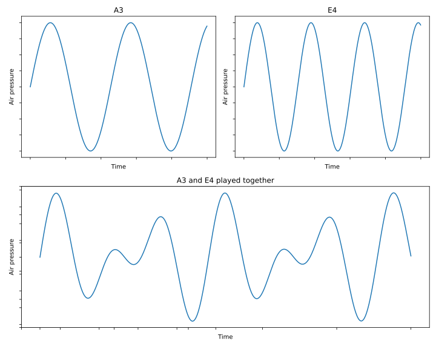

# Multi-voice Sound Generation with Arduino

## Foreword

### Motivations

I wrote the following article because I wanted to program the Arduino to produce multi-voice melody and the only resource I found was [this stackoverflow](https://stackoverflow.com/questions/28976608/arduino-how-to-create-two-or-more-tones-simultaneously-on-a-piezo-buzzer) Q&A. Most of the resources I found were incomplete or only a single-voice melody.


Now, why are **you** reading this? Or better, why **should** you be reading this? Direct Digital Synthesis has been around for long, sure enough there are tools out there to produce sound with several tones on an Arduino. The S/O link I have given does what we want; although I haven't played around with it much myself, the fantastic [Mozzi library](https://sensorium.github.io/Mozzi/examples/#01.Basics) will probably do most of what this article covers, if not more.

Truth be told, I like to understand things. When there is a topic that I find passionating, I won't stop trying to understand it until I get to the bottom of it. So, if you're into sound synthesis, messing around with Arduino and into trying to get it all sorted out in your head, this article is for you. If your only goal is to have fun with some noise, you might be better off with using the already implemented tools (this project's code, the S/O one or Mozzi's).

A little more about what this articles actually covers after the pre-requisites.

### Pre-requisites

This article is not a start-from-scratch article. My advice is, read the article as I give out resources to understand most of it along the way. But keep in mind that you will have an easier time if you already know about :

* **Basic [Digital Sound Processing](https://en.wikipedia.org/wiki/Digital_signal_processing) theory** : you should be comfortable with notions of frequency, waveforms, Nyquist-Shannon criteria, sampling, etc ;
* **Basic C/C++ and Arduino coding knowledge**: be able to turn on and off LEDs, be comfortable with basic C/C++ code ;
* **Arduino's timers** : you should know they exist and that they have several modes of operation. I won't go into details in this article, so it's better if you already have some experience with them. [This Arduino article](https://docs.arduino.cc/tutorials/generic/secrets-of-arduino-pwm/) is a nice overview of the timers' settings and use. The [Atmega 328p datasheet](https://www.google.com/url?sa=t&source=web&rct=j&opi=89978449&url=https://ww1.microchip.com/downloads/en/DeviceDoc/Atmel-7810-Automotive-Microcontrollers-ATmega328P_Datasheet.pdf&ved=2ahUKEwiyv5WH4fKIAxV4VqQEHSqtNmkQFnoECAkQAQ&usg=AOvVaw1saIayRRDKrz7YCcviikuY) is of course a great reference ;
* **Binary and hexadecimal handling**: this is pure conveniency.

Now, before-hand, a nice two-step exercice would be to try to:

 - produce a note using the `digitalWrite` and `delay` functions provided by Arduino
 - play a simple single-voice theme with that same technique, just to ensure you are comfortable with timing and frequency manipulations.

### The equipment

Here's what you'll need for this project :

* An [Atmega328p based](https://learn.sparkfun.com/tutorials/arduino-comparison-guide/atmega328-boards) Arduino board and its adapted flash method (USB cable, etc). I will use the Arduino Nano ;
* A **100nF capacitor** and a resistor of about 100 to 1000 Ohms ;
* A piezo buzzer ;
* A breadboard ;
* Some wires.

Additionnally, an oscilloscope is a great tool for signal debugging or simply enjoying the resulting product of one's work.

**About the Arduino board**: Having an Atmega328p based board is not a necessity in itself. It is however the one I will be using. Once you have covered this article and are comfortable with the Atmega's timer, you'll probably be able to port the code to some other boards.

## Theory on Direct Digital Synthesis with Arduino
### From sound to voltages

#### Back to the basics

Let's go back to the basics for a minute. What is sound?

Sound can be defined as the **propagation of a succession of compressions and decompressions** of a material (solid, gas or liquid). The speed at which these successions progate is called the **frequency**. The frequency determines the sound's **pitch**. The higher the frequency, the higher the pitch.

If we play a note in its purest form, the succession of compression and decompression of that note can be represented as a sinewave. To play two pure notes together is to sum up those two sinewaves.

<center></center>
<center>Figure — Sinewaves of A3 and E4 notes and their sum.</center>
<!-- Include figure of sum of two voices -->

Now, simply put, if we want to produce a sound modelled by a sinewave on an Arduino pin, all we have to do is to make the output voltage vary so as to make it produce a sine signal. Replace "Air Pressure" by "Voltage" on the graphs above, and you have our goal output.

#### Tweaking the output voltage with PWM

Okay so we want to output a varying voltage. Can we do that on the Arduino?
Yes and no.

I won't go into length here. If you are not familiar at all with PWM technic, [here](https://docs.arduino.cc/learn/microcontrollers/analog-output/) is an article that explains it better than I would. Simply put, on Arduino, one can only output $0$ V (off) or $5$ V (on) on a digital pin. But, if we turn on and off a pin really fast, the perceived voltage is midway between 0 and 5 volts, because the change happens so fast. 

What you should remember is : 

>  
> 
> $\quad$ We talk about a PWM duty cycle, that is, *a percentage of "on" time* ; the **final perceived voltage** is the **average of on and off time**.

The function `analogWrite` lets us choose the duty-cycle for a PWM output, and consequently outputs a voltage in the range $[0, 5]$ V (note that this range is discrete).
```cpp {.r .numberLines .lineAnchors}

analogWrite(pin, 25);   // 10% duty cycle
analogWrite(pin, 127);  // 50% duty cycle
analogWrite(pin, 255);  // 100% duty cycle


```
### Let's produce sound ! ... Maybe ?
#### A first strategy for melody generation

Now we know we can tweak an output voltage in the range $[0,5]$ V with `analogWrite`. A first idea could be to sample voltage values of a given melody at a frequency $f_{sample}$. Then, we could do something like:
```cpp {.r .numberLines .lineAnchors}

uint8_t voltages [NB_SAMPLES] = { /* Pre-computed samples ... */}
for(uint32_t sample = 0; sample < NB_SAMPLES; ++sample)
{
    setVoltage(pin, voltages[sample]);
    delay(1/f_sample);
}


```

Now, let's juste consider the maths here. If we take the classic $f_{sample} = 44.1$kHz, we get 44,100 samples per second. So for a one-second long melody, if we store the voltage values in some array of `uint8_t` , we already have 44.1 Kbytes of data. The Atmega 328p flash memory can only hold 32 Kbytes. So... Not a good strategy.

#### Look-up tables 
That's where DSP knowledge comes in handy. According to a certain [Fourier](https://en.wikipedia.org/wiki/Fourier_series), **any sound can be approximated by a series of sinusoidal components** whose frequencies are those of the fundamental and its harmonics. In one melody, some notes may be played multiples times. That's data redundancy. We need a way to hold only the necessary data. That's when **look-up tables** come in handy.

A look-up table (LUT) is an array that contains samples allowing for the generation of a waveform. In our case, the LUT contains samples for a period-long frame of time, allowing the generation of a periodical waveform (like a sinewave for example). 

<center><div width="100px"></div></center>
<center>Figure — Sinewaves samples for a LUT.</center>

From this one LUT, we can generate **any note**. We simply need to output the values of the LUT more or less fast to adjust the note frequency. To play a continuous note of period $period$, considering a `uint8_t look_up_table[SAMPLES]` array, the code would look like :
```cpp {.r .numberLines .lineAnchors}

while(1)
{
    for(uint32_t sample = 0; sample < NB_SAMPLES; ++sample)
        {
            analogWrite(pin, look_up_table[sample]);
            delay(period/NB_SAMPLES);
        }
}


```
The delay is equal to $\frac{period}{\text{NB_SAMPLES}}$ because we want to go through the LUT in $period$ seconds.

Now, this is getting somewhere. But how would one play two continuous note? So far, we have an index walking through the LUT and we delay its walk with the `delay` function so that it takes a $period$ to walk through the LUT. But with two different notes, we have two different periods. Should we use two indexes? Two delays? And what if we want to play three, or four notes? And to not play them continuously ? This would get messy...

### Counting and generating

#### Timers and PWM

Let's take a small break to go back to PWM. We know the theory behind it and how to use it. But how does our micro processor actually produces PWM? Spoiler alert : not with `delay`.

PWM generation is based on *timers*. Again, [here](https://docs.arduino.cc/tutorials/generic/secrets-of-arduino-pwm/) is a resource that will explain it much better than I would.

Further on, we'll consider the following properties about timers :

>  
> 
> $\quad$ **A timer is a counter** that counts step by step at a given frequency $f_{cpu}$. It counts up until a top value that can be configured using register `ICR`. When the top value is reached, the timer **overflows** and goes back to 0. The **compare registers**, `OCRA` and `OCRB`, can hold a value that, when reached by the timer, sets a pin output to $5$ V. When the timer overflows, the pin output is set back to $0$ V.

From this, we understand that calling `analogWrite` is just setting a specific value in the `OCRA` or `OCRB` registers. 

The Atmega 328p has several timers, some are 8-bit (maximum value is $2^{8}-1=255$), some are 16-bit (maximum value is $2^{16}-1=65535$). 

The frequency at which the timer counts depends on two parameters : the micro-processor **internal clock frequency** (*hardware*), and the **prescaler** (*software*). The Atmega328p has $16$ MHz clock frequency. $f_{cpu}$ is thus defined by:

$$f_{cpu} = \dfrac{f_{clock}}{prescaler} = \dfrac{16 \text{MHz}}{prescaler}$$


The **compare registers**, OCRA and OCRB, control specific pins. We'll use OCRA which controls pin 9. Again, refer to the [Atmega 328p datasheet](https://www.google.com/url?sa=t&source=web&rct=j&opi=89978449&url=https://ww1.microchip.com/downloads/en/DeviceDoc/Atmel-7810-Automotive-Microcontrollers-ATmega328P_Datasheet.pdf&ved=2ahUKEwiyv5WH4fKIAxV4VqQEHSqtNmkQFnoECAkQAQ&usg=AOvVaw1saIayRRDKrz7YCcviikuY) to find this information.

#### The phase accumulator

Back to generating sound. We want to play two notes but using `delay` to keep track of where to look in the LUT is getting messy because two different notes have two different period. So : how do we keep track of where to look in the LUT for each note?

Meet the **phase accumulator technic**. A **phase accumulator (PA)** is a **value that generates** a discrete-time, **discrete-valued phase** argument for a lookup table. It basically **tracks down time** so that we know where to look in the LUT at any time.

Now, [this article](https://www.norwegiancreations.com/2022/03/digital-audio-synthesis-part-1-the-oscillator/) explains how to produce an **oscillator** which is basically a single-voice melody, and introduces the *phase accumulator (PA)*. Reading this article is almost enough to accomplish our goal but it lacks the LUT knowledge exposed here. Still a great resource tho, I advice you to read it as it mentions important notes on sound quality.


Anyways, the article tells the following about the PA:

>  
> 
> $\quad$The **PA** (*phase accumulator*) is made by incrementing a counter at a given frequency with something called a “Frequency Control Word”.
>
> It’s always incremented at the same time-interval (period), but it is the “Frequency Control Word” that decides the output-frequency. 
> 
> [...] when the phase accumulator reaches its top value, it wraps down to 0."

Here, the bigger brains will have understood why we explained the timer theory just before that. We are going to use the timers coupled with a phase accumulator to keep up on where to look in the LUT.  

The article mentions a sort of overflow for the phase accumulator. To make it easier, we'll often choose the maximum value for the PA to be the maximum value that can be stored in the type of variable used to store the PA. So for example, if we choose to store the PA in a `uint16_t`, its maximum value is 65535.

Now, the article mentions **Frequency Control Word**, also known as the **Tuning Word**. One thing that many articles like the one I mentionned do, is give away an equation that defines the tuning word without never actually explaining how the equation was obtained, which makes the definition of the tuning word quite oscur. Here is a clear and detailed explanation of that value: 

#### The tuning word

As said previously, the idea behind the phase accumulator is to decrease it down to zero, by using a constant decrement : the **tuning word**.

The phase accumulator starts to its maximum value. It often is $2^N$ where $N$ is the number of bits used for the PA.


Say we want to generate a note $note$ of period $t_{out}$ using a timer of period $t_{cpu}$. There is an integer $n$ such as :

$$t_{out} \approx n t_{cpu} \quad\quad (1)$$

So, the timer iterates $n$ times before reaching the $note$'s period. Hence, the PA is decremented $n$ times before reaching zero. So we get the following equation for the tuning word size $\Delta f$:

$$\Delta f \approx \dfrac{max\_pa}{n} \approx \dfrac{2^N}{n}\quad (2)$$

By inversing the relationship (1) to switch to the frequency domain, we get:

$$f_{out} \approx \dfrac{1}{n} f_{cpu}\quad\quad (3)$$


Now, let's get $f_{cpu}$ on the left side of this equation and let's multiply the equation by $max\_pa$ :

$$max\_pa\dfrac{f_{out}}{f_{cpu}} \approx \dfrac{max\_pa}{n} \quad\quad (4)$$

Injecting (2) in (4), we finally get :
$$ \Delta f \approx max\_pa\dfrac{f_{out}}{f_{cpu}} \approx 2^N\dfrac{f_{out}}{f_{cpu}} \quad\quad (5)$$

Now hopefully you understand what the tuning word is.

### Recap'
#### Strategy
So far, our strategy to produce a note of frequency $f$ and of period $t= 1/f$ is :

* We store $m$ samples of a sinewave in a look-up table ;
* We use an Arduino timer to count one by one at frequency of $f_{cpu}$;
* We decrement a phase accumulator when our timer overflows ;
* We increment our look-up table index when our phase accumulator overflows ;
* We set our compare register to the correct value in the LUT.

So with one look-up table and $p$ phase accumulator and indexes, we can theoretically produce $p$ voices !

#### Constraints 
I say theoretically because we're not exactly able to produce a 1000 voices melody.

But how many voices can we fit exactly?

Understand that we are limited by our voltage levels, which is determined by our timer resolution. Remember we can choose a voltage output by playing with a PWM duty cycle. With an N-bit timer, the maximum value of our timer is $2^{N}-1$, but its TOP value can be less than that (remember the `ICR` register?). So we have $TOP$ different voltage levels in the range $[0,5]$ V. Remember also that playing $p$ voices at the same time is equivalent to outputing the sum of their signal. This means the number of voices $p$ cannot exceed $TOP \leq 2^{N}-1$.

Now, we also have to consider the limit of the flash memory. Although we don't have to store 44,100 samples for each second of our melody any more, we still have to store the melody in some ways. Let's not forget the room is already occupied by the look-up table and the overall algorithm we will use later on. So, even if in theory we could go up to 65535 voices with a 16-bit timer, we won't actually ever go there. And it's not like we'd need that many anyway. Twelve voices are already enough to play an orchestral version of the Mario Theme Music for example. A simpler version really only needs three.

#### Quality considerations

Last step before diving into the code. The following are really just information to keep in mind, quality-wise.

I mentionned that [Ragnar Ranøyen Homb's article](https://www.norwegiancreations.com/2022/03/digital-audio-synthesis-part-1-the-oscillator/) highlights some points regarding sound quality. One interesting formula is the following:

$$f_{res} = \dfrac{f_{cpu}}{max\_pa}$$

The **frequency resolution** is the **smallest achievable difference in frequency** in regard to the generating parameters. Evidently, the realm of generated frequencies is discrete. So, the frequency resolution the difference between two consecutive generated frequencies. And it is totally dependent on the timer's frequency and the PA size. Both have their limits: the PA depends of course on the flash memory resources. As for the $f_{cpu}$, as Homb's article states:

>  
> 
> $\quad$ The clock is directly coupled to the highest frequency possible to create. According to Nyquist [...] the NCO [(*equivalent to what we call the timer*)] clock needs to be >= 2 * highest created frequency. So if the NCO [~ timer] input clock runs at 100 kHz we can (in theory) create a waveform at 50 kHz."

We will see further on that some other parameters reduce the cpu's clock frequency for us and therefore, we actually really want to have the highest $f_{cpu}$ possible to keep some flexibility.

Another quality factor is the number of samples constituting the LUT. It doesn't take that many samples to accomplish a beautiful square wave, however, a sinewave will sound better with a greater amount of samples.

## Let's code !

And now... The moment you have all been waiting for ! The coooode ! It is all avaible on [Github](https://github.com/grybouilli/multi-voice-for-Arduino).

### Some scripts

First, let me introduce some python scripts that will generate some things for us. Mainly, we need a script to generate the look-up tables and a script to generate the tuning words. 

An interesting fact to generate the tuning words is the [relationship between the different notes' frequencies](https://en.wikipedia.org/wiki/Twelfth_root_of_two). Take the frequency of any note on a piano, that'll be f. If you go up by $i$ semitones (a semitone being the relationship between two neighbor key), the resulting frequency will be:

$$ f_i = f \times 2^{\frac{i}{12}}$$

The relationship works for negative values of $i$. This is great because it means we can recreate all the note's frequencies we want from one single frequency, and we can order them according to that one frequency.

Because most notes' frequencies aren't rational numbers, we will choose an A for our base frequency. A notes' frequencies are multiples of $110$ Hz; e.g the famous A4 is $440$ Hz.

I'll let you have a look at [gen_look_up.py](https://github.com/grybouilli/multi-voice-for-Arduino/blob/main/gen_look_up.py) which generates sinewave, 25% square, 50% square, triangle, sawtooth and semisine look-up tables. The amount of samples by default is 16.

Please also have a look at [gen_words.py](https://github.com/grybouilli/multi-voice-for-Arduino/blob/main/gen_words.py) which generates the tuning words and something that I call the **index size**. Basically, if there are $m$ samples in the LUT and the phase accumulator's maximum values is $max\_pa$, we define index size by:

$$index\_size = \dfrac{max\_pa}{m}$$

This is the **number of timer steps to pass before jumping to the next value in the LUT**. It is equivalent to the value by which the PA is decreased before moving on to the next value in the LUT.

You can mess around with the different parameters described in the [common_utils.py](https://github.com/grybouilli/multi-voice-for-Arduino/blob/main/common_utils.py) file.

### Multi-voice signals

First, let's generate continous notes played together. Our main file looks like this:

```cpp {.r .numberLines .lineAnchors}
#include "voices.hpp"
#include "notes.hpp"

uint8_t overflow_counter = 0;

MultiV::Voice voices [MultiV::VOICES];

void setup()
{
    MultiV::init_multiv();

    init_voice(voices[0], A4, MultiV::SQUARE50);
    init_voice(voices[1], C5, MultiV::SQUARE50);
    init_voice(voices[2], E5, MultiV::SQUARE50);
    init_voice(voices[3], A5, MultiV::SQUARE50);
    init_voice(voices[4], C6, MultiV::SQUARE50);
}

ISR(TIMER1_OVF_vect)
{
    // New output computed at a frequency of 16000000/127/4 = 31496.1 Hz 
    // We compute a new value every 4 overflows 
    // Below that, the sound is not recognizable
    // Above that, we are not generating fast enough and the sound gets de-tuned (as in, the changes made get audible because they happen at a frequency < 20kHz).
    if (overflow_counter++ & (MultiV::SKIP - 1)){ return; }

    uint8_t out = 0;

    for(uint8_t voice = 0; voice < MultiV::VOICES; ++voice)
    {
        if(voices[voice].on) 
        {
        voices[voice].phase_acc -= MultiV::get_tuning_word(voices[voice]);
        if(voices[voice].phase_acc < 0)
        {
            voices[voice].phase_acc += MultiV::INDEX_SIZE;
            voices[voice].phase_idx++;
            voices[voice].phase_idx %= MultiV::LU_SIZE;
        }
        out += MultiV::get_voice_output(voices[voice]);
        }
    }

    OCR1AL = out;
}

void loop()
{
    
}
```

Let's step through this code and focus on the interesting parts.

The `Voice` structure from line 6 contains the following:

```cpp {.r .numberLines}
struct Voice
{
    int16_t phase_acc;
    uint8_t phase_idx;
    uint8_t note;
    uint8_t octave;
    Waveform style;
    bool on;
};
```

The `init_multiv` function sets the parameters for the timers. These are detailed in the file [voices.cpp](https://github.com/grybouilli/multi-voice-for-Arduino/blob/main/multivoice/voices.cpp).

Notice lines 4 and 25. We define an `overflow_counter`. On line 25, we check that we have passed 3 interrupts (= timer overflows) before actually doing the job of computing the next data. That is because below 4 timer overflows, the signal isn't recognizable. This means that each sample of the LUT is sent out at least 4 times. Now, as mentioned on line 24, above 4, we are dividing the timer frequency too much and our computation becomes noticeable. So 4 is the perfect number really.

The rest of this code should be pretty straight forward.

Feel free to browse through the [voices.cpp](https://github.com/grybouilli/multi-voice-for-Arduino/blob/main/multivoice/voices.cpp) file to see the implementation of the different `MultiV` functions.

### Add some rythm

Okay, so we can play several continuous notes simultaneously. But I promised you a melody. Let's had some rythm to that !

The idea is to transform a music sheet into code. Now, at this point, you'll probably need some music theory for that. For this example, I'll implement the first 14 measures of the [Super Mario Bros Main Theme](https://musescore.com/user/2072681/scores/2601926) (without the repetition).

<center></img></center>

We need three voices as the highest number of simultaneously played notes is 3 (ignore the four notes of measure 2, we'll only keep 3). 

The idea is to base the rythm generation on the smallest time unit in the theme. In our case, it is the **quaver**. So, to play a quarter means that we are playing two joined quavers. 

We have a tempo of 180, that is, there are 180 quarters in one minute, thus, 360 quavers in one minute. That means a quaver is $\tau =167$ ms long.

We'll replace the triplet quarter of measure 5 by two quavers and a quarter.

The whole melody playing job will be put in the `loop` function. Every $\tau$, we move onto the next quaver to play. But every $\tau/2$, we check whether the quaver we play is going to be linked to the one after it to form a quarter. If the quaver doesn't form a quarter, we silence in the middle of the quarter so that we can hear the distinct notes. Think of it as applying an enveloppe on the sound (a pretty abrupt one). The quaver we'll hear is really $\tau/2$ long.

Now, how do we know whether a quaver is linked to the following quaver? We store each note of the melody as a tuple $\{X, b\}$, where $X$ is the note to play and $b$ is 0 or 1, depending on whether the quaver is part of a quarter or not.

Some helper macros have been defined in the file [notes.hpp](https://github.com/grybouilli/multi-voice-for-Arduino/blob/main/multivoice/notes.hpp) to make the code easier to read.

Here is the final code :

```cpp {.r .numberLines}
#include "voices.hpp"
#include "notes.hpp"

#define QUARTER(X) {X, 1}, {X, 0}
#define QUAVER(X) {X, 0}

#define NOTE_COUNT 120
const uint16_t tempo = 167; // one eigth is 167 ms
const uint16_t time_event = tempo/2; 

uint8_t overflow_counter = 0;

MultiV::Voice voices [MultiV::VOICES];

struct Note
{
    uint16_t tone;
    bool hold;
};

uint8_t event_idx = 0;
uint8_t melody_idx = 0;

// Super Mario Bros : Main Theme
// From the following sheet : https://musescore.com/user/2072681/scores/2601926
int16_t const melody[MultiV::VOICES][NOTE_COUNT][2]
{
    {
        QUAVER(E5), QUAVER(E5), QUAVER(SILENCE), QUAVER(E5), QUAVER(SILENCE), QUAVER(C5),  QUARTER(E5),     
        QUARTER(G5), QUARTER(SILENCE), QUARTER(G4), QUARTER(SILENCE),
        QUARTER(C4), QUAVER(SILENCE), QUARTER(G4), QUAVER(SILENCE), QUARTER(E4), 
        QUAVER(SILENCE), QUARTER(A4), QUARTER(B4), QUAVER(As4), QUARTER(A4),
        QUAVER(G4), QUAVER(E5), QUARTER(G5), QUARTER(A5), QUAVER(F5), QUAVER(G5),
        QUAVER(SILENCE), QUARTER(E5), QUAVER(C5), QUAVER(D5), QUARTER(B4), QUAVER(SILENCE),
        QUARTER(SILENCE), QUAVER(G5), QUAVER(Fs5), QUAVER(F5), QUARTER(Ds5), QUAVER(E5),                    
        QUAVER(SILENCE), QUAVER(Gs4), QUAVER(A4), QUAVER(C5), QUAVER(SILENCE), QUAVER(A4), QUAVER(C5), QUAVER(D5),
        QUARTER(SILENCE), QUAVER(G5), QUAVER(Fs5), QUAVER(F5), QUARTER(Ds5), QUAVER(E5),
        QUAVER(SILENCE), QUARTER(C6), QUAVER(C6), QUARTER(C6), QUARTER(SILENCE),
        QUARTER(SILENCE), QUAVER(G5), QUAVER(Fs5), QUAVER(F5), QUARTER(Ds5), QUAVER(E5),                    
        QUAVER(SILENCE), QUAVER(Gs4), QUAVER(A4), QUAVER(C5), QUAVER(SILENCE), QUAVER(A4), QUAVER(C5), QUAVER(D5),
        QUARTER(SILENCE), QUARTER(Ds5), QUAVER(SILENCE), QUARTER(D5), QUAVER(SILENCE),
        QUARTER(C5), QUARTER(SILENCE), QUARTER(SILENCE), QUARTER(SILENCE),
        QUARTER(SILENCE), QUARTER(SILENCE), QUARTER(SILENCE), QUARTER(SILENCE)
    },
    {
        QUAVER(Fs4), QUAVER(Fs4), QUAVER(SILENCE), QUAVER(Fs4), QUAVER(SILENCE), QUAVER(Fs4), QUARTER(Fs4),  
        QUARTER(B4), QUARTER(SILENCE), QUARTER(B4), QUARTER(SILENCE),
        QUARTER(E4), QUAVER(SILENCE), QUARTER(C4), QUAVER(SILENCE), QUARTER(G3), 
        QUAVER(SILENCE), QUARTER(C4), QUARTER(D4), QUAVER(Cs4), QUARTER(C4),
        QUAVER(C4), QUAVER(G4), QUARTER(B4), QUARTER(C5), QUAVER(A4), QUAVER(B4),
        QUAVER(SILENCE), QUARTER(A4), QUAVER(E4), QUAVER(F4), QUARTER(D4), QUAVER(SILENCE),
        QUARTER(SILENCE), QUAVER(E5), QUAVER(Ds5), QUAVER(D5), QUARTER(B4), QUAVER(C5),                     
        QUAVER(SILENCE), QUAVER(E4), QUAVER(F4), QUAVER(G4), QUAVER(SILENCE), QUAVER(C4), QUAVER(E4), QUAVER(F4),
        QUARTER(SILENCE), QUAVER(E5), QUAVER(Ds5), QUAVER(D5), QUARTER(B4), QUAVER(C5),
        QUAVER(SILENCE), QUARTER(G5), QUAVER(G5), QUARTER(G5), QUARTER(SILENCE),
        QUARTER(SILENCE), QUAVER(E5), QUAVER(Ds5), QUAVER(D5), QUARTER(B4), QUAVER(C5),                     
        QUAVER(SILENCE), QUAVER(E4), QUAVER(F4), QUAVER(G4), QUAVER(SILENCE), QUAVER(C4), QUAVER(E4), QUAVER(F4),
        QUARTER(SILENCE), QUARTER(Gs4), QUAVER(SILENCE), QUARTER(F4), QUAVER(SILENCE),
        QUARTER(E4), QUARTER(SILENCE), QUARTER(SILENCE), QUARTER(SILENCE),
        QUARTER(SILENCE), QUARTER(SILENCE), QUARTER(SILENCE), QUARTER(SILENCE)
    },
    
    {
        QUAVER(D3), QUAVER(D3), QUAVER(SILENCE), QUAVER(D3), QUAVER(SILENCE), QUAVER(D3), QUARTER(D3),  
        QUARTER(G4), QUARTER(SILENCE), QUARTER(G3), QUARTER(SILENCE),
        QUARTER(G3), QUAVER(SILENCE), QUARTER(E3), QUAVER(SILENCE), QUARTER(C3), 
        QUAVER(SILENCE), QUARTER(F3), QUARTER(G3), QUAVER(Fs3), QUARTER(G3),
        QUAVER(E3), QUAVER(C4), QUARTER(E4), QUARTER(F4), QUAVER(D4), QUAVER(E4),
        QUAVER(SILENCE), QUARTER(C4), QUAVER(A3), QUAVER(B3), QUARTER(G3), QUAVER(SILENCE),
        QUARTER(C3), QUAVER(SILENCE), QUAVER(G3), QUARTER(SILENCE), QUARTER(C4),                        
        QUARTER(F3), QUAVER(SILENCE), QUAVER(C4), QUARTER(C4), QUARTER(F3),
        QUARTER(C3), QUAVER(SILENCE), QUAVER(G3), QUARTER(SILENCE), QUAVER(G3), QUAVER(C4),
        QUAVER(SILENCE), QUARTER(F5), QUAVER(F5), QUARTER(F5), QUARTER(G3),
        QUARTER(C3), QUAVER(SILENCE), QUAVER(G3), QUARTER(SILENCE), QUARTER(C4),                        
        QUARTER(F3), QUAVER(SILENCE), QUAVER(C4), QUARTER(C4), QUARTER(F3),
        QUARTER(C3), QUARTER(Gs3), QUAVER(SILENCE), QUARTER(As3), QUAVER(SILENCE),
        QUARTER(C4), QUAVER(SILENCE), QUAVER(G3), QUARTER(G3), QUARTER(C3),
        QUARTER(SILENCE), QUARTER(SILENCE), QUARTER(SILENCE), QUARTER(SILENCE)
    }
};

void setup()
{
    MultiV::init_multiv();

    MultiV::init_voice(voices[0], melody[0][0][0], MultiV::SQUARE50);
    MultiV::init_voice(voices[1], melody[1][0][0], MultiV::SQUARE25);
    MultiV::init_voice(voices[2], melody[2][0][0], MultiV::SAWTOOTH);
}

ISR(TIMER1_OVF_vect)
{
    // New output computed at a frequency of 16000000/127/4 = 31496.1 Hz 
    // We compute a new value every 4 overflows 
    // Below that, the sound is not recognizable
    // Above that, we are not generating fast enough and the sound gets de-tuned (as in, the changes made get audible because they happen at a frequency < 20kHz).
    if (overflow_counter++ & (MultiV::SKIP - 1)){ return; }

    uint8_t out = 0;

    for(uint8_t voice = 0; voice < MultiV::VOICES; ++voice)
    {
        if(voices[voice].on) 
        {
        voices[voice].phase_acc -= MultiV::get_tuning_word(voices[voice]);
        if(voices[voice].phase_acc < 0)
        {
            voices[voice].phase_acc += MultiV::INDEX_SIZE;
            voices[voice].phase_idx++;
            voices[voice].phase_idx %= MultiV::LU_SIZE;
        }
        out += MultiV::get_voice_output(voices[voice]);
        }
    }

    OCR1AL = out;
}

void loop()
{
    if(event_idx == 2) 
    {
        melody_idx++;
        melody_idx %= NOTE_COUNT;
        event_idx = 0;
    } 

    for(uint8_t voice = 0; voice < MultiV::VOICES; ++voice)
    {
        if(!event_idx || event_idx && melody[voice][melody_idx][1])
            MultiV::set_voice(voices[voice], melody[voice][melody_idx][0]);
        else
            MultiV::set_voice(voices[voice], SILENCE);
    }

    delay(time_event);
    event_idx++;
}
```

This bad boy of a program weighs 2788 bytes, that is 2.8KB, way below the maximum 32 KB that the Atmega can hold. So, we could implement some much longer melody.

### Some ideas for the future

In the current code, we apply a form of envelope that is quite abrupt. We play the sound at full volume for half the note's time and then silence it for the other half. If you've ever heard of [ADSR envelope](https://www.musicgateway.com/blog/music-industry/music-production/adsr-envelope), this could be a quite interesting feature to add to our current code. What's mostly needed is to reduce our `time_event` variable and temper with the note's volume as it's being played.

You can try some envelope before hand with [this nice tool](https://phyanim.sciences.univ-nantes.fr/Ondes/son/synthese_son.php).

In the S/O topic I referenced earlier in this article, the person who answered the question even changed the type of waveform during the note's output depending on the date in the note's output, to make it fade away mor smoothly.

## Contact & Contribution

Any contributions on the code through [Github](https://github.com/grybouilli/multi-voice-for-Arduino/) is welcome.  

If you have questions or want to discuss, don't hesitate to e-mail me at `<my-github-username> @ outlook . fr`.


## References

* [Arduino - How to create two or more tones simultaneously on a piezo buzzer?, *stackoverflow*](https://stackoverflow.com/questions/28976608/arduino-how-to-create-two-or-more-tones-simultaneously-on-a-piezo-buzzer)
* [The Mozzi Library](https://sensorium.github.io/Mozzi/examples/#01.Basics)
* [Digital Signal Processing, *Wikipedia*](https://en.wikipedia.org/wiki/Digital_signal_processing)
* [Secrets of Arduino PWM, *Arduino*](https://docs.arduino.cc/tutorials/generic/secrets-of-arduino-pwm/)
* [Atmega328p Datasheet, *Atmel*](https://ww1.microchip.com/downloads/en/DeviceDoc/Atmel-7810-Automotive-Microcontrollers-ATmega328P_Datasheet.pdf)
* [Arduino Comparison Guide - JIMBLOM, *Sparkfun*](https://learn.sparkfun.com/tutorials/arduino-comparison-guide/atmega328-boards)
* [Basic of PWM, *Arduino*](https://docs.arduino.cc/learn/microcontrollers/analog-output/)
* [Fourier Series, *Wikipedia*](https://en.wikipedia.org/wiki/Fourier_series)
* [Digital audio synthesis part 1: The oscillator - Ragnar Ranøyen Homb, *Norwegian Creations*](https://www.norwegiancreations.com/2022/03/digital-audio-synthesis-part-1-the-oscillator/)
* [multi-voice for Ardunio - grybouilli, *Github*](https://github.com/grybouilli/multi-voice-for-Arduino)
* [Twelth root of two, *Wikipedia*](https://en.wikipedia.org/wiki/Twelfth_root_of_two)
* [The Super Mario Bros Main Theme, *musescore*](https://musescore.com/user/2072681/scores/2601926)
* [ADSR Envelope in Music Explained - Sam Jones, *Music Gateway*](https://www.musicgateway.com/blog/music-industry/music-production/adsr-envelope)
* [Synthèse d'un son musical - Geneviève Tulloue, *Université de Nantes*](https://phyanim.sciences.univ-nantes.fr/Ondes/son/synthese_son.php)